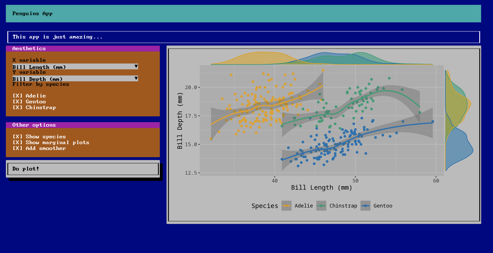

<!-- README.md is generated from README.Rmd. Please edit that file -->

# shiny386

<!-- badges: start -->
[](https://CRAN.R-project.org/package=shiny386)
[](https://www.tidyverse.org/lifecycle/#experimental)
[](https://github.com/RinteRface/shiny386/actions)
<!-- badges: end -->

The goal of shiny386 is to provide an old school Bootstrap 4 template for Shiny. It is built on top of the [Bootstrap 386](http://kristopolous.github.io/BOOTSTRA.386/demo.html) HTML template.

## Installation

You can install the released version of shiny386 from Github with:

``` r
pak::paks("RinteRface/shiny386")
```

## Example



<p class="text-center">
<a 
class="btn btn-primary" 
data-bs-toggle="collapse" 
href="#demo-code" 
role="button" 
aria-expanded="false" 
aria-controls="demo-code">
Toggle code
</a>
</p>

<div class="collapse" id="demo-code">
```{r, results="asis", echo=FALSE, warning=FALSE, comment = ""}
shiny386:::print_r_code("penguins")
```
</div>